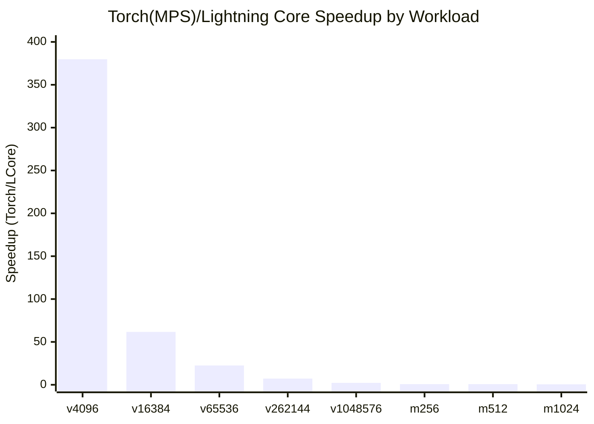

# Exia

Exia is a torch-style Python library for machine learning and deep learning, built on top of Lightning Core.
It is designed for fast experimentation with:

- standalone Lightning Core workflows (no torch required)
- torch-native training workflows (optional)
- Hugging Face model and pipeline loading (optional)

## Install

From local workspace root:

```bash
python -m pip install -e ./Exia
```

Standalone core install from package index:

```bash
python -m pip install Exia
```

Torch mode install:

```bash
python -m pip install "Exia[torch]"
```

Torch + Hugging Face mode install:

```bash
python -m pip install "Exia[full]"
```

## Quick Start

```python
import Exia as ex

ex.set_backend("lightning")
x = ex.tensor([[1.0, 2.0], [3.0, 4.0]])
print(type(x), x.shape)

trainer = ex.Trainer(ex.TrainerConfig(epochs=100, log_every=20))
w, b = trainer.fit_linear_regression([[1.0], [2.0], [3.0]], [2.0, 4.0, 6.0])
print(w, b)
```

## Lightning Core Integration

```python
import Exia as ex

out = ex.lightning_vector_add([1, 2, 3], [4, 5, 6], device="metal")
print(out)
```

## Hugging Face Integration

Requires `Exia[hf]`.

```python
import Exia as ex

pipe = ex.load_hf_pipeline("sentiment-analysis", "distilbert-base-uncased-finetuned-sst-2-english")
print(pipe("Exia looks practical."))
```

## Minimal Deep Learning Training Example

Requires `Exia[torch]`.

See:

- examples/train_mlp.py
- examples/hf_inference.py
- examples/standalone_linear.py
- examples/standalone_classification.py

## Standalone ML Utilities

Core Exia (without torch) includes:

- train_test_split
- fit_linear_regression (with optional L2 regularization)
- fit_logistic_regression (binary classification)
- mse, mae, r2_score, accuracy

Example:

```python
import Exia as ex

ex.set_backend("lightning")

x = [[1.0], [2.0], [3.0], [4.0]]
y = [2.1, 3.9, 6.2, 8.1]

model = ex.fit_linear_regression(x, y, lr=0.05, epochs=600)
pred = model.predict(x)
print(ex.mse(y, pred), ex.r2_score(y, pred))
```

## Notes

- Exia defaults to `lightning` backend and works without torch.
- Use `ex.set_backend("torch")` to switch to torch mode when installed.
- You can also set backend by environment variable: `EXIA_BACKEND=lightning` or `EXIA_BACKEND=torch`.
- On macOS Apple Silicon, torch MPS and Lightning Core Metal paths can both be used.

Environment variable example:

```bash
EXIA_BACKEND=torch python your_script.py
```

If the value is invalid or torch is unavailable, Exia falls back to `lightning` backend.

## Benchmark Snapshot (2026-03-29, local Apple Silicon)

This section compares Torch(MPS) and Lightning Core backends on the same machine.

| Bench | Shape | Lightning Core ms | Torch MPS ms | Speedup (Torch/LCore) |
| --- | --- | ---: | ---: | ---: |
| vector_add | n=4096 | 0.0008 | 0.3149 | 379.78x |
| vector_add | n=16384 | 0.0030 | 0.1873 | 61.70x |
| vector_add | n=65536 | 0.0085 | 0.1914 | 22.53x |
| vector_add | n=262144 | 0.0284 | 0.2058 | 7.26x |
| vector_add | n=1048576 | 0.1116 | 0.2508 | 2.25x |
| matmul | m=256,k=256,n=256 | 0.5526 | 0.4161 | 0.75x |
| matmul | m=512,k=512,n=512 | 0.3508 | 0.2572 | 0.73x |
| matmul | m=1024,k=1024,n=1024 | 1.3727 | 0.7817 | 0.57x |

Interpretation:

- Lightning Core is clearly stronger on vector-add style paths in this environment.
- Torch MPS is stronger on larger dense matmul in this run.
- Exia lets you select backend per workload, so you can use the better path for each operator family.



Raw artifacts:

- benchmarks/latest/torch_mps_vs_lightning_core.csv
- benchmarks/latest/torch_mps_vs_lightning_core.json
- benchmarks/latest/lightning_core_sweep_summary.json

## Repository Sync

This Exia source is maintained in the lightning-core monorepo and synchronized to the standalone Exia repository.
Use `scripts/sync_exia_and_push.sh` from the lightning-core repository root to sync and push updates.
