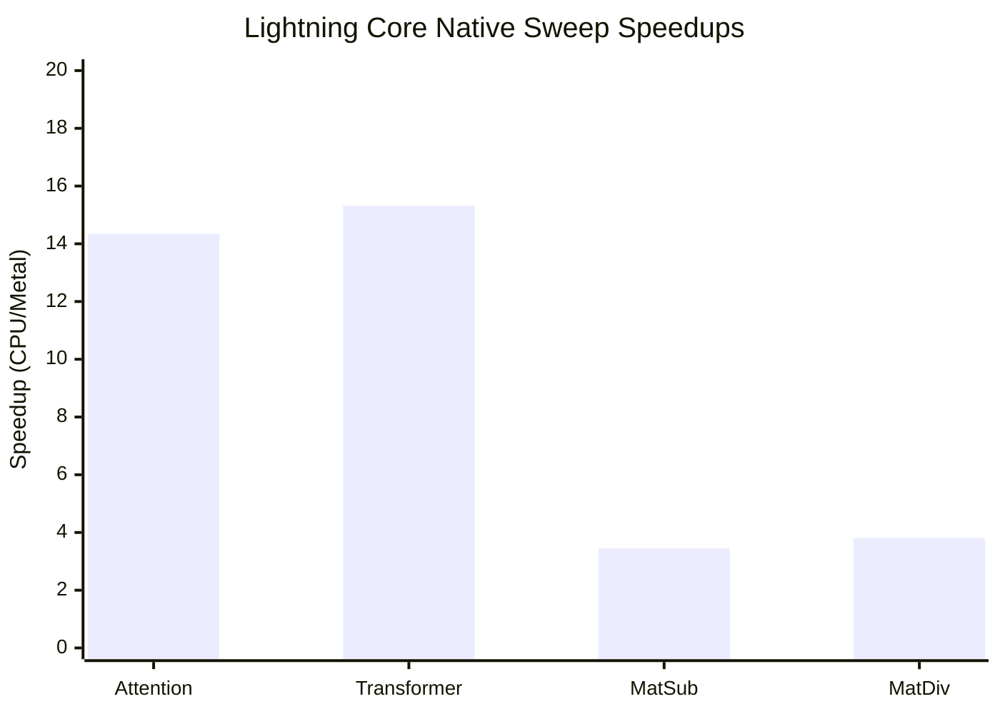

### Torch(MPS) vs Lightning Core (Latest Local Run)

| Bench | Shape | Lightning Core ms | Torch MPS ms | Speedup (Torch/LCore) |
| --- | --- | ---: | ---: | ---: |
| vector_add | n=4096 | 0.0008 | 0.3149 | 379.78x |
| vector_add | n=16384 | 0.0030 | 0.1873 | 61.70x |
| vector_add | n=65536 | 0.0085 | 0.1914 | 22.53x |
| vector_add | n=262144 | 0.0284 | 0.2058 | 7.26x |
| vector_add | n=1048576 | 0.1116 | 0.2508 | 2.25x |
| matmul | m=256,k=256,n=256 | 0.5526 | 0.4161 | 0.75x |
| matmul | m=512,k=512,n=512 | 0.3508 | 0.2572 | 0.73x |
| matmul | m=1024,k=1024,n=1024 | 1.3727 | 0.7817 | 0.57x |

### Lightning Core Native Sweep Highlights

- Attention best speedup: 14.35x at seq=2048, dim=64
- Transformer best speedup: 15.32x at seq=1024, dim=64
- Matrix sub best speedup: 3.45x
- Matrix div best speedup: 3.81x
- Vector add crossover (metal recommended from): n=65536

