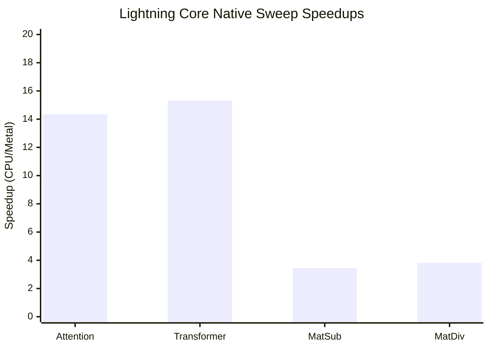

### Torch(MPS) vs Lightning Core (Latest Local Run)

| Bench | Shape | Lightning Core ms | Torch MPS ms | Speedup (Torch/LCore) |
| --- | --- | ---: | ---: | ---: |
| vector_add | n=4096 | 0.0008 | 0.3401 | 421.89x |
| vector_add | n=16384 | 0.0031 | 0.3042 | 99.45x |
| vector_add | n=65536 | 0.0083 | 0.1926 | 23.33x |
| vector_add | n=262144 | 0.0285 | 0.2101 | 7.38x |
| vector_add | n=1048576 | 0.1087 | 0.2559 | 2.35x |
| matmul | m=1024,k=1024,n=1024 | 0.9845 | 1.2519 | 1.27x |
| matmul | m=512,k=512,n=512 | 0.2957 | 0.2617 | 0.89x |
| matmul | m=2048,k=2048,n=2048 | 5.7157 | 4.7575 | 0.83x |
| matmul | m=256,k=256,n=256 | 0.2373 | 0.1943 | 0.82x |

### Lightning Core Native Sweep Highlights

- Attention best speedup: 14.35x at seq=2048, dim=64
- Transformer best speedup: 15.32x at seq=1024, dim=64
- Matrix sub best speedup: 3.45x
- Matrix div best speedup: 3.81x
- Vector add crossover (metal recommended from): n=65536

